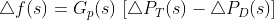
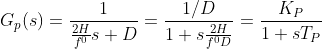
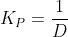
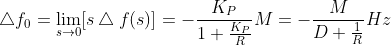
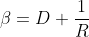
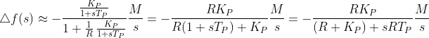
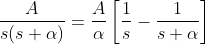
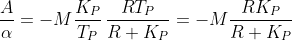
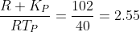

### INTRODUCTION 
#### The ALFC is balancing the real power and load demand by which the frequency of the power system is controlled. 
#### The major duties of the ALFC are to 
1. control the system frequency 
2. control the inter-state real power 
3. share the load among the operated synchronous generating units based on their regulation.
#### The input signal of primary ALFC is the frequency deviation ∆f of power system obtained in Energy management center. These error signals ∆f is amplified and transformed to a real power signal, that controls the steam/water inlet at the turbines of thermal/hydro synchronous generators [4]. 
 

### CONCEPT 
#### Real power control of primary ALFC is one of the significant control actions in power system under normal operating condition to match power generation with incessantly varying demand. 
#### The primary ALFC of the single area power system has four main components of speed governor, hydraulic amplifying unit, turbine unit, the model of power system. 
#### The transfer function of the four components is obtained from the mathematical modelling of their linearised equations. Thereby the non-linearity and saturations are ignored. 
#### This experiment mainly focuses on to know the modelling of primary ALFC and its block diagram parameters. Also it is helpful to understand how the frequency is maintained by primary ALFC of the single area power system.

### FORMULAE 
 
 
 
 
 
 
 
 
 
 
 
 
 
 
 
 
 
 
 